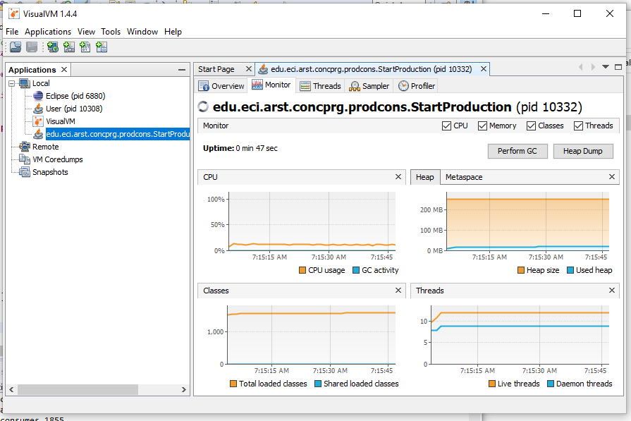
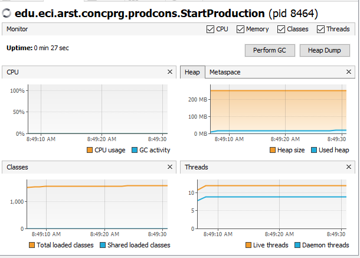
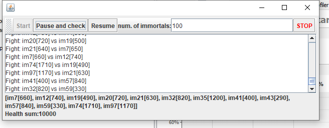
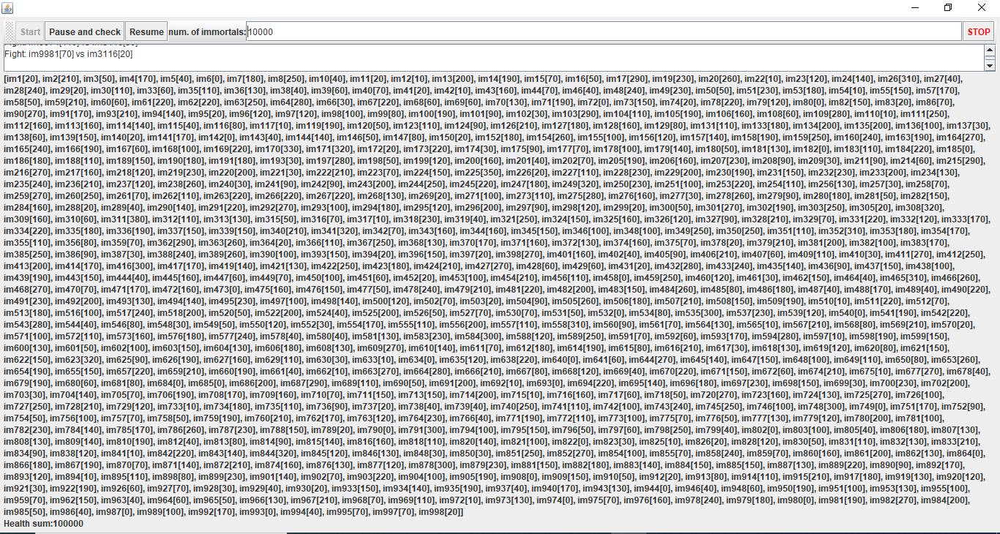

# ARSW-LAB02

### Integrantes

- Jeisson Sanchez
- Mateo Gonzalez

## Solucion:

**Parte I**

**Compilar**

~~~
mvn -U package
~~~

**Ejecutar:**

~~~
mvn exec:java -Dexec.mainClass="edu.eci.arst.concprg.prodcons.StartProduction"
~~~

1. Control de hilos con esperar / notificar. Productor / consumidor
Verifique el funcionamiento del programa y ejecútelo. Mientras esto ocurre, ejecute jVisualVM y verifique el consumo de CPU del proceso correspondiente. 
    **¿Por qué es este consumo?** Tanto el consumidor como el productor estan realizando operaciones sobre la memoria añadir y quitar elementos de una pila.   **¿Cuál es la clase responsable?** Son responsables tanto el consumidor como productor dado a que ambos acceden a los mismos datos.   

2. Haga lo necesario para ajustar el consumo de cpu mas eficiente, verifica en JVisualVM    
3. Haga que el productor ahora produzca muy rápido, y el consumidor consume lentamente. Teniendo en cuenta que el productor conoce un límite de existencias (cuántos elementos debería tener, como máximo en la cola), hace que se respete ese límite. Revise la API de la colección utilizada como cola para ver cómo asegurarse de que no se supere este límite. Verifique que, al establecer un pequeño límite para el 'stock', no haya un alto consumo de CPU o errores.

**Parte II**

**Compilar**

~~~
mvn -U package
~~~

**Ejecutar:**

~~~
mvn exec:java -Dexec.mainClass="edu.eci.arsw.highlandersim.ControlFrame"
~~~

1. Revisa “highlander-simulator”
2. Revise el código e identifique cómo se implementó la funcionalidad indicada anteriormente. Dada la intención del juego, una invariante debería ser que la suma de los puntos de vida de todos los jugadores sea siempre la misma (por supuesto, en un instante de tiempo en el que no se está procesando una operación de aumento / reducción de tiempo). Para este caso, para N jugadores, ¿cuál debería ser este valor?    La Sumatroia de las vidas de los N jugadores deberia ser 100*N

3. Ejecute la aplicación y verifique cómo funciona la opción "pausar y verificar". ¿Se cumple lo invariante?    No se cumple, el poton pausar y verificar no realiza ningna accion  
4. Una primera hipótesis de que se presenta la condición de carrera para esta función (pausa y verificación) es que el programa consulta la lista cuyos valores imprimirá, mientras que otros hilos modifican sus valores. Para corregir esto, haga lo que sea necesario para que, antes de imprimir los resultados actuales, todos los otros hilos estén en pausa. Además, implemente la opción "reanudar".
5. Verifique la operación nuevamente (haga clic en el botón muchas veces). ¿Se cumple o no la invariante?    No los valores cambian con cada pause y resume   
6. Identifica posibles regiones críticas con respecto a la lucha de los inmortales. Implemente una estrategia de bloqueo que evite las condiciones de carrera. Recuerde que si necesita usar dos o más "bloqueos" simultáneamente, puede usar bloques sincronizados anidados  a) Es necesario implementar una region critica en el metodo fight para que 2 immortales no se ataquen al tiempo   
7. Después de implementar su estrategia, comience a ejecutar su programa y preste atención a si se detiene. Si es así, use los programas jps y jstack para identificar por qué se detuvo el programa.   No se detuvo la ejecucion del programa
8. Considere una estrategia para corregir el problema identificado anteriormente (puede revisar el Capítulo 15 de la concurrencia de Java en la práctica nuevamente).
9. Una vez que se corrige el problema, rectifique que el programa continúa funcionando constantemente cuando se ejecutan 100, 1000 o 10000 inmortales. Si en estos casos grandes el invariante comienza a ser violado nuevamente, debe analizar lo que se hizo en el paso 4.   Si se encuentra funcionando correctamente    **Caso 100**        **Caso 1000**    **Caso 10000**   
10. 648/5000
Un elemento molesto para la simulación es que en cierto momento hay pocos 'inmortales' vivos que pelean con 'inmortales' ya muertos. Es necesario suprimir a los muertos inmortales de la simulación a medida que mueren.   **a)** Analizando el esquema de operación de simulación, ¿podría esto crear una condición de carrera? Implemente la funcionalidad, ejecute la simulación y vea qué problema surge cuando hay muchos 'inmortales' en ella. Escriba sus conclusiones al respecto en el archivo RESPUESTAS.txt. Para solucionarlo el veifica y si su vida es 0, el es removido del ArrayList **b)** Corrija el problema anterior SIN usar la sincronización, ya que hacer que el acceso a la lista compartida de inmortales sea secuencial haría que la simulación sea extremadamente lenta.
11. Implemente STOP
